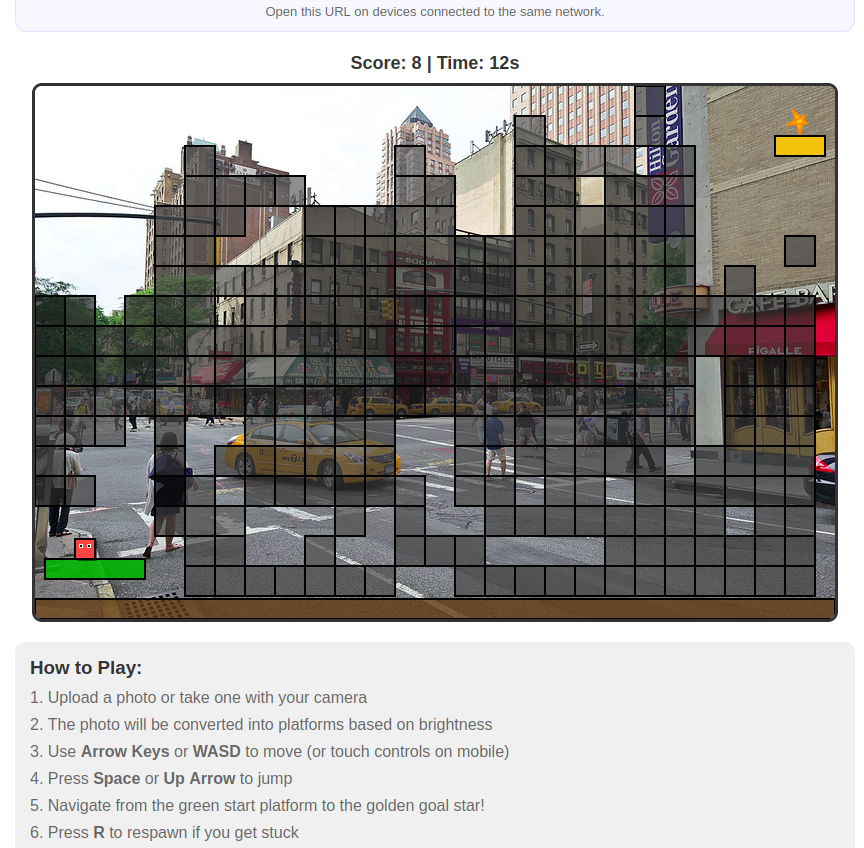

 
 
 
 Exploring Ideas Through Code: One Experiment at a Time

## About These Projects

All of my projects exist for one main reason: **learning through experimentation**.  
Each repository is a result of me asking questions like:  
> “Is this possible?”  
> “I wonder if…?”  

Sometimes they’re attempts to solve real problems I’ve come across, other times they’re just me following curiosity down a rabbit hole.  
This is my **learning playground**, a space where I test ideas, try new things, and learn by doing.  

I share them here in case they help or inspire someone else.  
So expect some projects to be **messy**, others **well-structured**, all of them are honest reflections of learning in progress.  

Feel free to **use**, **modify**, or **build on** anything here. 

So here we go:


# Photo Jumper 🎮

A web-based platform jumping game that converts your photos into playable levels!

→ Follow the development notes on the `learning/journey` branch: [Learning Journey (Branch)](#learning-journey-branch)

### Before / After

| Before (main) | After (learning/journey) |
| --- | --- |
|  |  |


## Features

- 📸 **Photo Upload**: Upload a photo from your device or take one with your camera
- 🔒 **Privacy First**: All photos are processed entirely in your browser - no uploads, no storage, no transmission to any server
- 🎨 **Dynamic Level Generation**: Photos are automatically converted into block-based platforms
- 🧱 **Retro Block Aesthetic**: 16-bit Mario-style modular block platforms with clear collision boundaries
- 🤖 **ML Object Detection (Experimental)**: Optional ONNX-based detection for 51 object types
- 🖼️ **Photo Background**: Your photo displays as the game background with zoom and camera following
- 🎮 **Classic Platform Gameplay**: Jump and navigate through your photo-based levels
- 🔤 **Letter Collection**: Collect letters to spell words for bonus points
- 🚪 **Goal Portal**: Walk into the glowing golden portal to complete the level
- 🕹️ **Multiple Control Options**:
  - Keyboard: Arrow Keys or WASD to move, Space/Up/W to jump
  - Touch: Touch controls for mobile devices
  - Zoom: +/- keys or mouse wheel, on-screen buttons in fullscreen
  - Special: R to respawn, G to regenerate level
- 🔄 **Level Regeneration**: Press G to regenerate platforms if you get stuck
- 📊 **Score Tracking**: Points for height progress, letter collection, word completion, and correct order
- 📱 **Responsive Design**: Works on desktop and mobile devices
- 📲 **Installable PWA**: Install as a standalone app
- 🔌 **Offline Support**: Play without internet after first visit

## How to Play

1. Open `index.html` in your web browser
2. Click "Upload Photo" to select an image from your device, or "Take Photo" to use your camera
3. The photo will be converted into a playable level:
   - **Grid-Based**: Brightness detection creates platforms from darker areas
   - **ML Detection (Optional)**: Checkbox to detect 51 object types as platforms:
     - Furniture (chairs, tables, couches, beds)
     - Vehicles (cars, buses, trains, airplanes, bicycles)
     - Electronics (laptops, TVs, keyboards, microwaves)
     - Animals (cats, dogs, horses, elephants, giraffes, bears)
     - People (jump on heads Mario-style!)
     - Sports equipment (skateboards, surfboards, snowboards)
     - And more!
4. Navigate through the level:
   - **Move**: Arrow Keys, WASD, or touch controls
   - **Jump**: Space, Up Arrow, W, or jump button
   - **Zoom**: +/- keys, mouse wheel, or on-screen buttons (fullscreen)
   - **Camera**: Automatically follows player
5. **Collect letters** to spell words for bonus points
6. **Walk into the golden portal** to complete the level
7. **Press G** to regenerate platforms if stuck
8. **Press R** to respawn at start position
9. Click "← Exit" to return to photo selection

**Tip**: Try photos of your pets, living room, parking lot, or zoo for best ML results!

## 📱 Play on Mobile (Quick Start)

**The easiest way to play on your phone:**

1. **Visit on your mobile browser:**
   ```
   https://mcfuzzysquirrel.github.io/photo-jumper/
   ```
   (Replace with your actual GitHub Pages URL)

2. **Add to Home Screen:**
   - **iOS (Safari):** Tap Share (⎵) → "Add to Home Screen"
   - **Android (Chrome):** Tap Menu (⋮) → "Add to Home Screen"

3. **Launch & Play:**
   - Tap the icon on your home screen
   - Works like a native app!
   - Works offline after first visit
   - No app store needed!

**First time setup:** (~10 seconds)
- Upload or take a photo
- Enable "ML object detection" (optional - takes 5-10s first time)
- Touch controls automatically appear
- Start playing!

## Install as App (PWA)

Photo Jumper is a Progressive Web App (PWA) that can be installed on your device:

**Desktop (Chrome/Edge):**
1. Visit the game URL
2. Click the install icon (⊕) in the address bar
3. Click "Install"

**Mobile - iOS (Safari):**
1. Visit the game URL in Safari (must use Safari, not Chrome)
2. Tap the Share button (⎵) at the bottom
3. Scroll down and tap "Add to Home Screen"
4. Tap "Add" (top right)
5. App appears on home screen - tap to launch!

**Mobile - Android (Chrome):**
1. Visit the game URL in Chrome
2. Tap the menu (⋮) → "Add to Home Screen"
3. Or tap the install banner when it appears
4. Tap "Install"
5. App appears on home screen - tap to launch!

Once installed, Photo Jumper works offline and launches like a native app!

## Quick Start

**Play Online (Easiest):**

Visit the live version:
```
https://mcfuzzysquirrel.github.io/photo-jumper/
```

Then follow the "Play on Mobile" section above to install on your phone!

**Play Locally:**

Simply open `index.html` in any modern web browser. No installation or build process required!

Note: the in-game feedback form requires running the local server (below). If you open the file directly (`file://`), gameplay works but feedback submission and ML detection will not work.

**Run Local Server:**

```bash
npm install
npm start
```

Then navigate to `http://localhost:8080` in your browser.

## LAN Server + Feedback (Offline)

If you want other people on your WiFi/LAN (mobile/tablet/computer) to access the game over HTTP *and* send feedback, run the included local server (requires Node.js + npm).

```bash
cd photo-jumper
npm install
npm start
```

By default it listens on `0.0.0.0:8080` so other devices can reach it.

1. Find your LAN IP (for example `192.168.x.x` or `10.x.x.x`)
2. On another device on the same network, open:
  - `http://<your-lan-ip>:8080/`

Tip (Linux): you can often get your LAN IP with:

```bash
hostname -I | awk '{print $1}'
```

Feedback is text-only and stored locally (daily rotated) in `feedback/YYYY-MM-DD.jsonl`.

## Triage Feedback → GitHub Issues (Interactive)

To turn selected feedback entries into GitHub issues (one-by-one, step-through), use the included interactive triage script.

Prereqs:
- GitHub CLI installed (`gh`)
- Authenticated (`gh auth login`)
- Run from inside this repo so it can auto-detect the target repo from the git remote

Run:

```bash
npm run feedback:issues
```

Notes:
- The script **auto-creates missing labels** (minimal set: `feedback`, `needs-triage`, and `device: ...`).
- For privacy, issues **never include IP or User-Agent**, even though the local logs contain them.
- Each created issue includes a hidden dedupe marker like `<!-- pj-feedback-id: ... -->` so reruns can detect duplicates.

Common overrides:

```bash
# Use a specific feedback file
npm run feedback:issues -- feedback/2026-01-25.jsonl

# Use a specific repo (override git remote detection)
npm run feedback:issues -- --repo McFuzzySquirrel/photo-jumper

# Preview only (no labels/issues created)
npm run feedback:issues -- --dry-run
```

In the game UI:
- Use the **Feedback** button to send feedback (message + device type).
- Use the **Share link** panel to copy the current URL. If it shows `localhost`, replace it with your LAN IP when sharing to other devices.

### Optional access code

If you want to require an access code to submit feedback:

```bash
FEEDBACK_TOKEN=your-code-here npm start
```

When the token is enabled, the web UI will prompt for the access code the first time someone submits feedback (it will be remembered on that device).

### Configuration

Environment variables (optional):
- `PORT` (default: `8080`)
- `HOST` (default: `0.0.0.0`)
- `FEEDBACK_TOKEN` (default: empty)

### Firewall note

If other devices can't connect, you may need to allow the port in your firewall (example for UFW):

```bash
sudo ufw allow 8080/tcp
```

## Architecture Decisions

Architecture Decision Records are tracked in [docs/adr/README.md](docs/adr/README.md).

## Learning Journey (Branch)

If you’re curious about how Photo Jumper evolves, there’s an in-repo learning log on the `learning/journey` branch.

Why it exists:
- Capture experiments and design reasoning (especially around gameplay fairness)
- Keep “learning notes” and small iteration docs close to the code
- Make it easier for others (and future-me) to follow the why, not just the what

What you’ll find there:
- A lightweight journal in `learning/journey/` (notes, decisions, templates)
- Work-in-progress thinking that may not belong on `main` yet

How to follow it:
```bash
git fetch origin
git switch learning/journey
```

## Troubleshooting

### ML Detection Issues

**"ML detection failed to load" error:**
- **First time:** ML downloads ~8 MB from CDN (takes 5-10 seconds)
- **Solution:** Wait for download, check internet connection
- **Offline:** After first load, ML works offline (cached)

**"Failed to load external data file" error:**
- Model file didn't load
- **Solution:** Refresh the page, clear browser cache
- GitHub Pages might still be deploying (~2 min after push)

**ML checkbox enabled but no platforms created:**
- Photo might not have detectable objects
- Enable "Debug overlay" to see what was detected
- Try photos with: pets, people, furniture, vehicles
- See console (F12) for detection results

**iOS Safari specific issues:**
- Must use Safari for "Add to Home Screen" (not Chrome)
- Camera permission needed for "Take Photo"
- First visit requires internet (for ML files)

For complete troubleshooting, see [docs/ONNX_SETUP.md](docs/ONNX_SETUP.md)

## How It Works

The game uses HTML5 Canvas and modern web technologies to:

### Grid-Based Detection (Default)
1. Process uploaded images and analyze brightness levels
2. Generate platforms from darker areas of the image
3. Apply edge detection to find solid surfaces
4. Filter and merge platforms for optimal gameplay

### ML Object Detection (Optional)
1. Load ONNX Runtime Web from CDN (no installation needed!)
2. Run YOLOv8n object detection model in the browser
3. Detect 51 object types (furniture, vehicles, animals, people, electronics, etc.)
4. Generate platforms from detected object boundaries
5. Combine with grid-based platforms for hybrid approach

### Gameplay
1. Display the original photo as the game background
2. Render semi-transparent platforms with visible borders
3. Apply physics-based mechanics with gravity and collision detection
4. Support both keyboard and touch input for cross-platform compatibility

**All processing happens in your browser - no server required!**

For more details on ML detection, see [docs/ML_DETECTION_GUIDE.md](docs/ML_DETECTION_GUIDE.md)

## Browser Compatibility

Works in all modern browsers that support HTML5 Canvas and ES6 JavaScript:
- Chrome/Edge (recommended)
- Firefox
- Safari
- Opera

## License

MIT License - See [LICENSE](LICENSE) file for details
