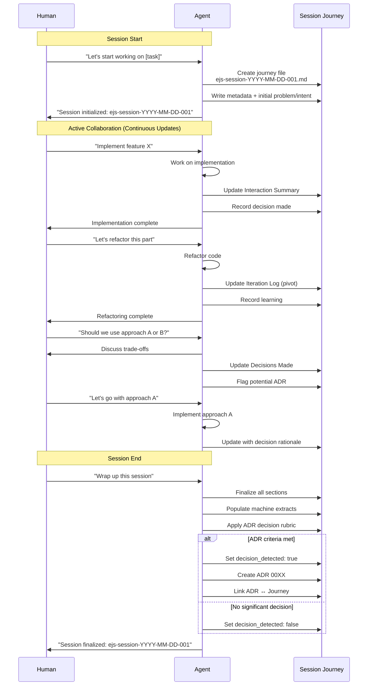
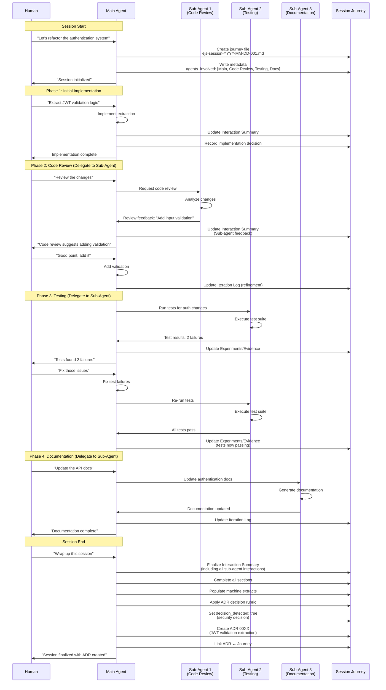
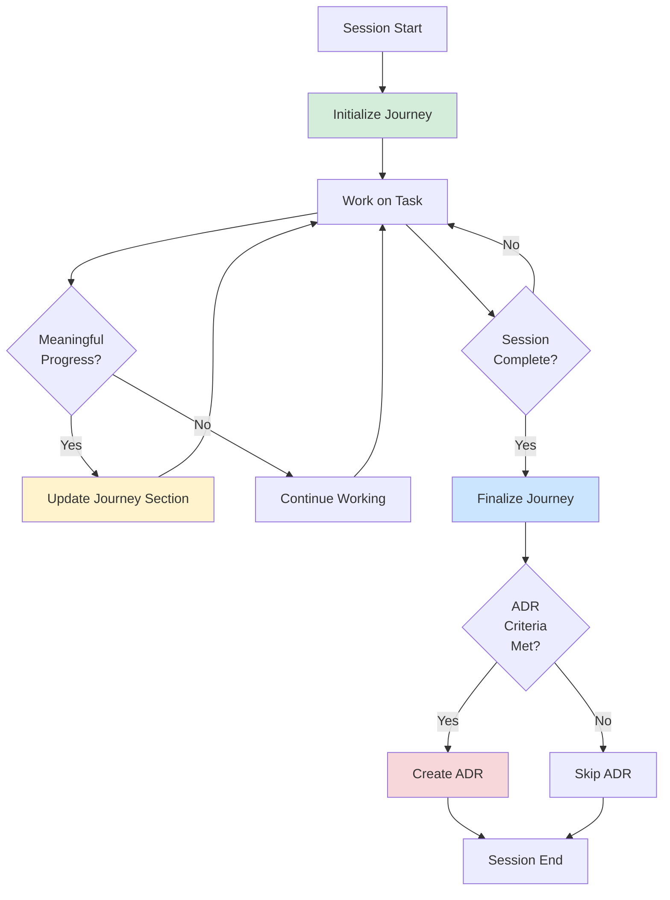
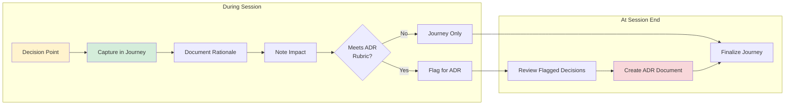

# Session Lifecycle Patterns

## Overview

EJS uses a **start-of-session initialization** with **continuous updates** approach rather than end-of-session reconstruction.

This pattern produces higher-quality documentation by capturing context in real-time as work progresses.

## Flow Diagrams

### Single User-Agent Interaction

The following diagram shows a typical EJS session with a single human user and one AI agent:



### Multi-Agent and Sub-Agent Scenario

The following diagram shows a more complex scenario with multiple agents and sub-agents collaborating on a task:



### Key Differences: Single vs Multi-Agent

| Aspect | Single Agent | Multi-Agent |
|--------|--------------|-------------|
| **Journey Updates** | Main agent updates directly | Main agent consolidates sub-agent inputs |
| **Interaction Summary** | Human ↔ Agent only | Human ↔ Main Agent ↔ Sub-Agents |
| **Agent Collaboration** | N/A | Captured in Agent Collaboration Summary |
| **Decision Attribution** | Clear single source | Track which agent contributed to decision |
| **Experiments** | Single agent's attempts | Multiple sub-agent experiments aggregated |
| **Complexity** | Linear interaction flow | Parallel/delegated work streams |

### Flow Patterns

**Continuous Update Pattern (Both Scenarios):**


**Decision Point Pattern:**


## Three-Phase Lifecycle

### Phase 1: Session Initialization (Start)

**When:** At the beginning of a new task, feature, or bug fix

**Triggers:**
- "Initialize session"
- "Let's start working on [task]"
- "Create session journey"
- Beginning work on a GitHub issue
- Starting a new feature or refactor

**Actions:**
1. Generate unique session ID: `ejs-session-YYYY-MM-DD-<seq>`
2. Create Session Journey file at `ejs-docs/journey/YYYY/<session-id>.md`
3. Populate initial metadata:
   - session_id
   - author
   - date
   - repo
   - branch
   - agents_involved
   - decision_detected: false (initial)
4. Capture initial **Problem/Intent**
5. Set up structure for continuous updates
6. Inform user that journey is initialized

**Benefits:**
- Clear session boundaries established upfront
- Context captured while fresh
- Reduces cognitive load at session end
- Sets expectations for continuous documentation

### Phase 2: Active Collaboration with Continuous Updates (During)

**When:** Throughout the entire working session

**What to Update:**
1. **Interaction Summary** - Add each meaningful human↔agent exchange as it occurs
   - Format: `- Human: <prompt> → Agent: <response> → Outcome: <result>`
   - Capture pivotal questions, constraints, and corrections in real-time

2. **Experiments/Evidence** - Record as experiments happen
   - What was tried
   - What happened
   - What evidence emerged

3. **Iteration Log** - Document pivots when they occur
   - Why the approach changed
   - What triggered the pivot

4. **Decisions Made** - Capture decisions immediately with rationale
   - Decision statement
   - Reason for choosing this approach
   - Expected impact
   - Whether it meets ADR criteria

5. **Key Learnings** - Record insights as they emerge
   - Technical discoveries
   - Prompting strategies that worked well
   - Tooling insights

**How Often to Update:**
- After completing a meaningful subtask
- When a decision is made
- After an experiment yields results
- When a pivot or iteration occurs
- After learning something valuable

**Benefits:**
- Accurate collaboration trail (not from memory)
- Context preserved when fresh
- No details lost to time
- Better multi-step/multi-agent session documentation
- Reduced burden at session end

### Phase 3: Journey Finalization (End)

**When:** Session is complete and ready to commit

**Triggers:**
- "Wrap up this session"
- "Finalize journey"
- "End session"
- "Ship it"
- "Commit this"
- "Commit and push"

**Actions:**
1. Review Session Journey for completeness
2. Finalize all sections with coherent summaries:
   - Complete Interaction Summary
   - Fill in Agent Collaboration Summary
   - Complete Agent Influence section
   - Finalize Experiments/Evidence
   - Complete Iteration Log
   - Ensure all Decisions are documented
   - Complete Key Learnings
   - Fill in "If Repeating This Work"
   - Complete Future Agent Guidance
3. Populate all `## MACHINE EXTRACTS` sections:
   - INTERACTION_EXTRACT
   - DECISIONS_EXTRACT
   - LEARNING_EXTRACT
   - AGENT_GUIDANCE_EXTRACT
4. Update `decision_detected` field based on ADR gate criteria
5. Create ADR if decision rubric is met
6. Update `adr_links` in Session Journey if ADR was created
7. Final save of Session Journey

**Benefits:**
- Most work already done throughout session
- Final review ensures coherence
- Machine extracts consolidate key information
- ADR decision is clear based on accumulated context

## Key Differences from End-of-Session Approach

### Old Approach (End-of-Session Only)
- ❌ All documentation written at the end
- ❌ Relies on memory and chat history
- ❌ Time-consuming reconstruction effort
- ❌ Details often lost or fuzzy
- ❌ Burden concentrated at session end
- ❌ Temptation to skip or rush documentation

### New Approach (Continuous Updates)
- ✅ Documentation starts immediately
- ✅ Context captured in real-time
- ✅ Incremental, low-overhead updates
- ✅ Accurate, detailed collaboration trail
- ✅ Burden distributed throughout session
- ✅ Session end is quick finalization, not creation

## Prompting Patterns for Agents

### At Session Start
```
"Initialize session for [task description]"
"Let's start working on [feature/bug]. Create the session journey."
"Begin session: [problem statement]"
```

### During Session (Implicit)
Agents should automatically update the Session Journey when:
- A decision is made
- An experiment completes
- A pivot occurs
- A learning emerges
- A meaningful interaction occurs

No explicit prompt needed if the agent is following EJS contracts.

### Explicitly Request Update (Optional)
```
"Update the session journey with our recent progress"
"Document this decision in the journey"
"Add this learning to the session journey"
```

### At Session End
```
"Wrap up this session"
"Finalize the journey"
"End session and create ADR if needed"
```

## Implementation Guidance for Agents

### Session Initialization
1. Check for existing session journey for today
2. Increment sequence number if needed
3. Use template from `ejs-docs/journey/_templates/journey-template.md`
4. Populate initial metadata accurately
5. Write problem/intent clearly
6. Confirm creation with user

### Continuous Updates
1. Keep updates atomic and focused
2. Don't rewrite entire journey each time
3. Append to relevant sections
4. Maintain chronological order in Interaction Summary
5. Keep format consistent
6. Save after each meaningful update

### Journey Finalization
1. Read current journey state
2. Fill any gaps in sections
3. Ensure coherence across sections
4. Populate machine extracts accurately
5. Apply ADR decision rubric objectively
6. Create ADR only when truly warranted
7. Link ADR ↔ Journey bidirectionally

## Example Session Flow

```
Human: "Let's start working on refactoring the authentication module"
Agent: Creates ejs-docs/journey/2026/ejs-session-2026-02-07-01.md
       Populates metadata and initial problem/intent
       "Session initialized: ejs-session-2026-02-07-01"

[Work begins]
Human: "Extract the JWT validation into a separate function"
Agent: Implements the refactoring
       Updates Interaction Summary in session journey
       Updates Iteration Log

[More work]
Human: "Should we use bcrypt or argon2 for password hashing?"
Agent: Discusses trade-offs (security vs. performance)
       Updates Decisions Made in session journey
       Flags as potential ADR candidate (security decision)

[More work]
Human: "Actually, let's stick with bcrypt for now since it's already in use"
Agent: Implements decision
       Updates Decisions Made with rationale (consistency)
       Updates Iteration Log (pivot from argon2 consideration)

[Session wraps up]
Human: "Wrap up this session"
Agent: Finalizes Session Journey
       - Completes all sections
       - Populates machine extracts
       - Reviews ADR criteria (decision on bcrypt = significant enough? No, minor)
       - Sets decision_detected: false
       - No ADR created
       "Session finalized: ejs-session-2026-02-07-01"
```

## Anti-Patterns to Avoid

### Don't Wait Until the End
❌ **Wrong:** Capture everything at session end from memory
✅ **Right:** Update journey incrementally throughout session

### Don't Overwrite, Append
❌ **Wrong:** Rewrite entire journey file each update
✅ **Right:** Append to existing sections, maintaining structure

### Don't Skip Important Context
❌ **Wrong:** "I'll remember this detail for later"
✅ **Right:** Document immediately while context is fresh

### Don't Create ADRs for Everything
❌ **Wrong:** Every decision triggers an ADR
✅ **Right:** Apply the ADR rubric objectively; most decisions stay in journey only

### Don't Ignore Mid-Session Pivots
❌ **Wrong:** Only document the final approach
✅ **Right:** Capture what was tried, why it changed, what evidence led to the pivot

## Success Metrics

A well-managed session journey should:
- ✅ Be readable as a standalone narrative
- ✅ Contain an accurate chronological collaboration trail
- ✅ Explain "why" for all major decisions
- ✅ Capture experiments and their outcomes
- ✅ Record learnings for future reuse
- ✅ Be mostly complete before session end (not a reconstruction effort)
- ✅ Have populated machine extracts for downstream parsing

## Migration from End-of-Session Approach

If adopting this pattern from the old end-of-session approach:

1. **Start new sessions with initialization**
   - Don't worry about retroactively updating old journeys
   - New sessions use the three-phase lifecycle

2. **Train the habit of continuous updates**
   - Start small: update after each major task
   - Gradually increase frequency as it becomes natural
   - Use explicit prompts at first ("update journey") until automatic

3. **Keep ADR gate standards consistent**
   - Same rubric applies whether decision made at start, middle, or end
   - Don't create more ADRs just because you're documenting more

4. **Celebrate reduced end-of-session burden**
   - Notice how finalization becomes quick review vs. full creation
   - Enjoy better documentation quality from real-time capture
